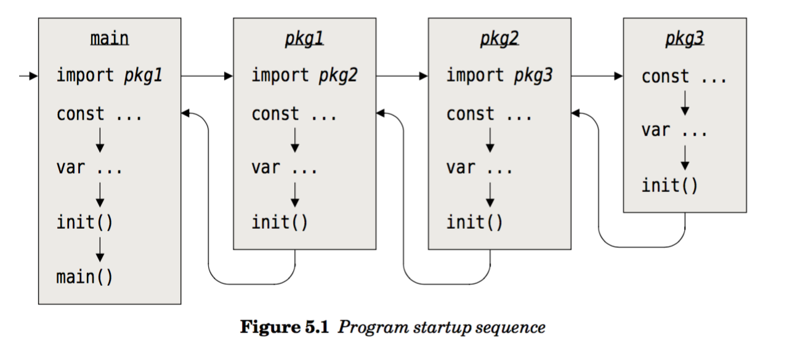

# Go 初始化过程

## 1. go程序初始化流程

* 1. 首先是import pkg的初始化过程
* 2. pkg中定义的const变量初始化
* 3. pkg中定义的var全局变量
* 4. pkg中定义的init函数，可能有多个




From: [Programming in Go]

## 2. go test程序的初始化

有时候运行 go test我们期望能够在测试前进行 setup 操作，而在测试完成后执行 teardown 操作，但是由于 go test 运行的不确定性，因此 go test 框架提供了一个 Main 函数实现这一机制。

```go
	func TestMain(m *testing.M) {
		// call flag.Parse() here if TestMain uses flags
		os.Exit(m.Run())
	}
```
