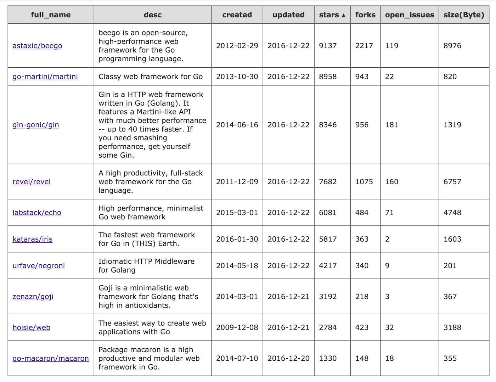

# Golang Web FrameWork

## 1. golang Web Framework 

参考：[谁是最快的Go Web框架](http://colobu.com/2016/04/06/the-fastest-golang-web-framework/)

## 2. 常用框架总结

数据截止到 2016年12月21号.

### 2.1 iris

[GitHub](https://github.com/kataras/iris) ⭐️ 5811 Fork 363

号称最快的go web框架，项目比较新，截止到目前大概9个月左右，基于fasthttp pkg，目前贡献者还是作者一个人。等同于node.js的web框架express.js。 [example](https://github.com/iris-contrib/examples)

[Features](https://docs.iris-go.com/features.html) 

- **Switch between template engines**: Select the way you like to parse your html files,
switchable via one-line configuration, read more
- **Typescript**: Auto-compile & Watch your client side code via the typescript plugin
- **Online IDE**: Edit & Compile your client side code when you are not home via the editor plugin
- **Iris Online Control**: Web-based interface to control the basics functionalities of your server via the iriscontrol plugin.
(Note that Iris control is still young).
- **Subdomains**: Easy way to express your api via custom and dynamic subdomains*
- **Named Path Parameters**: Probably you already know what this means. If not, It's easy to learn about
- **Custom HTTP Errors**: Define your own html templates or plain messages when http errors occur*
- **Internationalization**: i18n
- **Bindings: Need a fast way to convert data from body or form into an object? Take a look here
- **Streaming**: You have only one option when streaming comes into play*
- **Middlewares**: Create and\/or use global or per route middleware with Iris' simplicity*
- **Sessions**: Sessions provide a secure way to authenticate your clients\/users *
- **Realtime**: Realtime is fun when you use websockets*
- **Context**: Context is used for storing route params, storing handlers,
sharing variables between middleware, render rich content, send files and much more*
- **Plugins**: You can inject your own plugins into the Iris framework*
- **Full API**: All http methods are supported*
- **Party**: Group routes when sharing the same resources or middleware. You can organise a party with domains too! *
- **Transport Layer Security**: Provide privacy, authenticity and data integrity between your server and the client, you can serve using letsencrypt.org, automatic tls too*
- **Multi server instances**: Not only does Iris have a default main server, =you can declare as many as you need*
- **Zero configuration**: No need to configure anything for typical usage.Well-structured default configurations everywhere, which you can change with ease.
- **Zero allocations**: Iris generates zero garbage
- **Auto updater**: You're able to turn on the version checker & updater in case you forget to update your iris

### 2.2 martini

[Github](https://github.com/go-martini/martini) ⭐️ 8951 Fork 941

Martini是一个强大为了编写模块化Web应用而生的GO语言框架.  [Codis](https://github.com/CodisLabs/codis) 采用了该框架。

**功能列表**

1. 使用极其简单.
2. 无侵入式的设计.
3. 很好的与其他的Go语言包协同使用.
4. 超赞的路径匹配和路由.
5. 模块化的设计 - 容易插入功能件，也容易将其拔出来.
6. 已有很多的中间件可以直接使用.
7. 框架内已拥有很好的开箱即用的功能支持.
8. 完全兼容http.HandlerFunc接口.

Martini保持了核心代码的整洁性，更多的功能通过中间件来实现，参见 [martini-contrib](https://github.com/martini-contrib)

### 2.3 revel

[Github](https://github.com/revel/revel) ⭐️ 7672 Fork 1075

[Features](http://revel.github.io/)

1. **Hot Code Reload**

	Edit, save, and refresh. Revel compiles your code and templates for you, so you don't miss a beat. Code doesn't compile? It gives you a helpful description. Run-time code panic? Revel has you covered.

2. **Comprehensive**

	Revel provides **routing**, **parameter parsing**, **validation**, **session/flash**, **templating**, **caching**, **job running**, **a testing framework**, and even **internationalization**.

3. **HighPerformance**

	Revel builds on top of the Go HTTP server, which was recently benchmarked to serve three to ten times as many requests as Rails across a variety of loads.

### 2.4 Beego

[Github](https://github.com/astaxie/beego) ⭐️ 9128 Fork 2215

国人开发的，使用的圈子也是中国居多。

1. **简单化**

	RESTful 支持、MVC 模型，可以使用 bee 工具快速地开发应用，包括监控代码修改进行热编译、自动化测试代码以及自动化打包部署。

2. **智能化**
	
	支持智能路由、智能监控，可以监控 QPS、内存消耗、CPU 使用，以及 goroutine 的运行状况，让您的线上应用尽在掌握。

3. **模块化**

	beego 内置了强大的模块，包括 Session、缓存操作、日志记录、配置解析、性能监控、上下文操作、ORM 模块、请求模拟等强大的模块，足以支撑你任何的应用。

4. **高性能**

	beego 采用了 Go 原生的 http 包来处理请求，goroutine 的并发效率足以应付大流量的 Web 应用和 API 应用，目前已经应用于大量高并发的产品中。

### 3.5 echo

[Github](https://github.com/labstack/echo) ⭐️ 6074 Fork 482

#### Feature
- Optimized HTTP router which smartly prioritize routes
- Build robust and scalable RESTful APIs
- Group APIs
- Extensible middleware framework
- Define middleware at root, group or route level
- Data binding for JSON, XML and form payload
- Handy functions to send variety of HTTP responses
- Centralized HTTP error handling
- Template rendering with any template engine
- Define your format for the logger
- Highly customizable
- Automatic TLS via Let’s Encrypt
- HTTP/2 support
- Built-in graceful shutdown

### 3.6 web

[Github](https://github.com/hoisie/web) ⭐️ 2784 Fork 956

web.go should be familiar to people who've developed websites with higher-level web frameworks like sinatra or web.py. It is designed to be a lightweight web framework that doesn't impose any scaffolding on the user. Some features include:

- Routing to url handlers based on regular expressions
- Secure cookies
- Support for fastcgi and scgi
- Web applications are compiled to native code. This means very fast execution and page render speed
- Efficiently serving static files

### 3.7 Gin

[Github](https://github.com/gin-gonic/gin) ⭐️ 8341 Fork 423

Gin is a HTTP web framework written in Go (Golang). It features a Martini-like API with much better performance -- up to 40 times faster. If you need smashing performance, get yourself some Gin. https://gin-gonic.github.io/gin/

### 3.8 goji

[Github](https://github.com/zenazn/goji) [新版本](https://github.com/goji/goji) ⭐️ 3191 Fork 218

Goji is a HTTP request multiplexer, similar to net/http.ServeMux. It compares incoming requests to a list of registered Patterns, and dispatches to the Handler that corresponds to the first matching Pattern. Goji also supports Middleware (composable shared functionality applied to every request) and uses the standard context to store request-scoped values.

### 3.9 negroni

[Github](https://github.com/urfave/negroni) ⭐️ 4212 Fork 340

在Go语言里，Negroni 是一个很地道的 web 中间件，它是微型，非嵌入式，并鼓励使用原生 net/http 处理器的库。

如果你用过并喜欢 Martini 框架，但又不想框架中有太多魔幻性的特征，那 Negroni 就是你的菜了，相信它非常适合你。

### 3.9 macaron

[Github](https://github.com/go-macaron/macaron) ⭐️ 1330 Fork 148

Features:

- Powerful routing with suburl.
- Flexible routes combinations.
- Unlimited nested group routers.
- Directly integrate with existing services.
- Dynamically change template files at runtime.
- Allow to use in-memory template and static files.
- Easy to plugin/unplugin features with modular design.
- Handy dependency injection powered by inject.
- Better router layer and less reflection make faster speed.

功能提供通过各种 [middlewares](https://github.com/go-macaron) 。

### 3.10 Gorilla

官方网址： [http://www.gorillatoolkit.org/](http://www.gorillatoolkit.org/)

[Gorilla web toolkit](https://github.com/gorilla)

- gorilla/context stores global request variables.
- gorilla/mux is a powerful URL router and dispatcher.
- gorilla/reverse produces reversible regular expressions for regexp-based muxes.
- gorilla/rpc implements RPC over HTTP with codec for JSON-RPC.
- gorilla/schema converts form values to a struct.
- gorilla/securecookie encodes and decodes authenticated and optionally encrypted cookie values.
- gorilla/sessions saves cookie and filesystem sessions and allows custom session backends.
- gorilla/websocket implements the WebSocket protocol defined in RFC 6455.

### 3.11 参考

1. [Gorilla web toolkit](https://github.com/gorilla)

2. [go-http-routing-benchmark](https://github.com/julienschmidt/go-http-routing-benchmark)

3. [Golang几大框架的优势和区别？](http://studygolang.com/topics/466)

4. [A survey of 5 go web frameworks](http://thenewstack.io/a-survey-of-5-go-web-frameworks/) Beego Martini Gorilla GoCraft Net/HTTP
