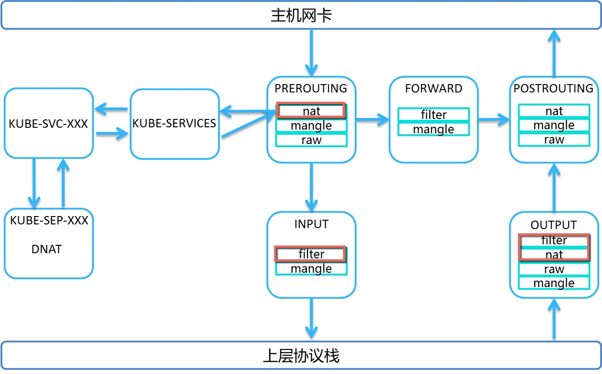

# Kube-proxy 源码分析

## 1. Kube-proxy 入口函数

k8s.io/kubernetes/cmd/kube-proxy/proxy.go


```go
func main() {
	command := app.NewProxyCommand()
	pflag.CommandLine.SetNormalizeFunc(utilflag.WordSepNormalizeFunc)
	pflag.CommandLine.AddGoFlagSet(goflag.CommandLine)

	command.Execute()
}
```

```go
// NewProxyCommand creates a *cobra.Command object with default parameters
func NewProxyCommand() *cobra.Command {
	opts, err := NewOptions()
	cmd := &cobra.Command{
		Use: "kube-proxy",
		Long: `....`,
		// command.Execute() 最终调用函数
		Run: func(cmd *cobra.Command, args []string) {
			verflag.PrintAndExitIfRequested()
			cmdutil.CheckErr(opts.Complete())
			cmdutil.CheckErr(opts.Validate(args))
			cmdutil.CheckErr(opts.Run())
		},
	}

	opts.config, err = opts.applyDefaults(opts.config)

	flags := cmd.Flags()
	AddFlags(opts, flags)

	cmd.MarkFlagFilename("config", "yaml", "yml", "json")

	return cmd
}
```

简化后的 Run() 入口函数调用层次如下：
```go
func Run(){
	opts, err := NewOptions()
	opts.Complete())
	opts.Validate(args))
	opts.Run()
}
```

k8s.io/kubernetes/cmd/kube-proxy/app/server.go

```go
func (o *Options) Run() error {
	config := o.config
	if len(o.ConfigFile) > 0 {
		o.loadConfigFromFile(o.ConfigFile)
		config = c
		utilfeature.DefaultFeatureGate.Set(config.FeatureGates)
	}

	proxyServer, err := NewProxyServer(config, o.CleanupAndExit, o.scheme, o.master)

	return proxyServer.Run()
}
```

此处只分析 proxyMode == proxyModeIPTables  的流程。

```go
// NewProxyServer returns a new ProxyServer.
func NewProxyServer(config *componentconfig.KubeProxyConfiguration, cleanupAndExit bool, scheme *runtime.Scheme, master string) (*ProxyServer, error) {
	var netshInterface utilnetsh.Interface
	var iptInterface utiliptables.Interface
	var dbus utildbus.Interface

	// Create a iptables utils.
	execer := exec.New()
	dbus = utildbus.New()
	iptInterface = utiliptables.New(execer, dbus, protocol)
	client, eventClient, err := createClients(config.ClientConnection, master)

	// Create event recorder
	hostname := nodeutil.GetHostname(config.HostnameOverride)
	eventBroadcaster := record.NewBroadcaster()
	recorder := eventBroadcaster.NewRecorder(scheme, clientv1.EventSource{Component: "kube-proxy", Host: hostname})

	var proxier proxy.ProxyProvider
	var serviceEventHandler proxyconfig.ServiceHandler
	var endpointsEventHandler proxyconfig.EndpointsHandler

	proxyMode := getProxyMode(string(config.Mode), iptInterface, iptables.LinuxKernelCompatTester{})
	if proxyMode == proxyModeIPTables {
		// TODO this has side effects that should only happen when Run() is invoked.
		proxierIPTables, err := iptables.NewProxier(
			iptInterface,
			utilsysctl.New(),
			execer,
			config.IPTables.SyncPeriod.Duration,
			config.IPTables.MinSyncPeriod.Duration,
			config.IPTables.MasqueradeAll,
			int(*config.IPTables.MasqueradeBit),
			config.ClusterCIDR,
			hostname,
			getNodeIP(client, hostname),
			recorder,
			healthzServer,
		)

		iptables.RegisterMetrics()
		proxier = proxierIPTables
		serviceEventHandler = proxierIPTables       // 设置 handler 
		endpointsEventHandler = proxierIPTables     // 设置 handler 
		userspace.CleanupLeftovers(iptInterface)
	} else {
		// user space proxy. omit
      	// ...
	}

	// Add iptables reload function, if not on Windows.
	if goruntime.GOOS != "windows" {
		iptInterface.AddReloadFunc(proxier.Sync)
	}

	nodeRef := &clientv1.ObjectReference{
		Kind:      "Node",
		Name:      hostname,
		UID:       types.UID(hostname),
		Namespace: "",
	}

	return &ProxyServer{
		Client:                 client,
		EventClient:            eventClient,
		IptInterface:           iptInterface,
		Proxier:                proxier,
		Broadcaster:            eventBroadcaster,
		Recorder:               recorder,
		ConntrackConfiguration: config.Conntrack,
		Conntracker:            &realConntracker{},
		ProxyMode:              proxyMode,
		NodeRef:                nodeRef,
		MetricsBindAddress:     config.MetricsBindAddress,
		EnableProfiling:        config.EnableProfiling,
		OOMScoreAdj:            config.OOMScoreAdj,
		ResourceContainer:      config.ResourceContainer,
		ConfigSyncPeriod:       config.ConfigSyncPeriod.Duration,
		ServiceEventHandler:    serviceEventHandler,   // proxierIPTables
		EndpointsEventHandler:  endpointsEventHandler, // proxierIPTables
		HealthzServer:          healthzServer,
	}, nil
}
```


```go
// Run runs the specified ProxyServer.  This should never exit (unless CleanupAndExit is set).
func (s *ProxyServer) Run() error {
	// ...
  
	if len(s.ResourceContainer) != 0 {
		// Run in its own container.
		resourcecontainer.RunInResourceContainer(s.ResourceContainer);
	}

	s.Broadcaster.StartRecordingToSink(&v1core.EventSinkImpl{Interface: s.EventClient.Events("")})

	// Start up a healthz server if requested
	if s.HealthzServer != nil {
		s.HealthzServer.Run()
	}

	// Tune conntrack, if requested
	// set related settings
	informerFactory := informers.NewSharedInformerFactory(s.Client, s.ConfigSyncPeriod)

     // k8s.io/kubernetes/pkg/proxy/config/config.go
	serviceConfig := proxyconfig.NewServiceConfig(informerFactory.Core().InternalVersion().Services(), s.ConfigSyncPeriod)
	serviceConfig.RegisterEventHandler(s.ServiceEventHandler) // proxierIPTables
  	
     // 监听 service 第一次同步结果，待 service 和 endpoint 都同步成功后，调用 proxier.syncProxyRules
	go serviceConfig.Run(wait.NeverStop)

    // k8s.io/kubernetes/pkg/proxy/config/config.go
	endpointsConfig := proxyconfig.NewEndpointsConfig(informerFactory.Core().InternalVersion().Endpoints(), s.ConfigSyncPeriod)
	endpointsConfig.RegisterEventHandler(s.EndpointsEventHandler) // proxierIPTables
  
    // 监听 Endpoints 第一次同步结果，待 service 和 endpoint 都同步成功后，调用 proxier.syncProxyRules
	go endpointsConfig.Run(wait.NeverStop)

	// This has to start after the calls to NewServiceConfig and NewEndpointsConfig because those
	// functions must configure their shared informer event handlers first.
    // 启动 informer 监听相关事件从 API Server的运行，包括 service 和 endpoint 事件的变化
	go informerFactory.Start(wait.NeverStop)

	// Birth Cry after the birth is successful
	s.birthCry()

	// Just loop forever for now...
	s.Proxier.SyncLoop()  // iptables.NewProxier().SyncLoop()
	return nil
}
```

k8s.io/kubernetes/pkg/proxy/config/config.go

### ServiceConfig创建和运行

```go
// NewServiceConfig creates a new ServiceConfig.
func NewServiceConfig(serviceInformer coreinformers.ServiceInformer, resyncPeriod time.Duration) *ServiceConfig {
   result := &ServiceConfig{
      lister:       serviceInformer.Lister(),
      listerSynced: serviceInformer.Informer().HasSynced,
   }

   serviceInformer.Informer().AddEventHandlerWithResyncPeriod(
      cache.ResourceEventHandlerFuncs{
         AddFunc:    result.handleAddService,
         UpdateFunc: result.handleUpdateService,
         DeleteFunc: result.handleDeleteService,
      },
      resyncPeriod,
   )

   return result
}

// ServiceHandler is an abstract interface of objects which receive
// notifications about service object changes.
type ServiceHandler interface {
	// OnServiceAdd is called whenever creation of new service object
	// is observed.
	OnServiceAdd(service *api.Service)
	// OnServiceUpdate is called whenever modification of an existing
	// service object is observed.
	OnServiceUpdate(oldService, service *api.Service)
	// OnServiceDelete is called whenever deletion of an existing service
	// object is observed.
	OnServiceDelete(service *api.Service)
	// OnServiceSynced is called once all the initial even handlers were
	// called and the state is fully propagated to local cache.
	OnServiceSynced()
}

// Run starts the goroutine responsible for calling
// registered handlers.
func (c *ServiceConfig) Run(stopCh <-chan struct{}) {
     // 一直等待 serviceInformer.Informer().HasSynced 的同步完成或者同步出错
	if !controller.WaitForCacheSync("service config", stopCh, c.listerSynced) {
		return
	}

	for i := range c.eventHandlers {
		c.eventHandlers[i].OnServiceSynced() // 此处实现的是观察者模式，观察者为 proxierIPTables
	}

	<-stopCh
}
```


k8s.io/kubernetes/pkg/proxy/iptables/proxier.go

```go
func (proxier *Proxier) OnServiceSynced() {
   proxier.mu.Lock()
   proxier.servicesSynced = true
   proxier.setInitialized(proxier.servicesSynced && proxier.endpointsSynced)
   proxier.mu.Unlock()

   // Sync unconditionally - this is called once per lifetime.
   proxier.syncProxyRules()
}
```


**syncProxyRules 函数会等待 proxier.servicesSynced 和 proxier.endpointsSynced 两者都同步成功后，才会运行，会在启动时候运行一次，后续会开启定时的全量同步。**


```go
// This is where all of the iptables-save/restore calls happen.
// The only other iptables rules are those that are setup in iptablesInit()
// This assumes proxier.mu is NOT held
func (proxier *Proxier) syncProxyRules() {
	// ...
    // 在该函数中完成了iptables的配置过程，主要是在nat表和filter表上挂载相关的自定义链条
}
```


Service 安装相关的位置：

* ChainInput                Filter

* ChainOutput             Filter  Nat

* ChainPrerouting       Nat

  ​

  

### EndpointsConfig创建和运行

```go

// NewEndpointsConfig creates a new EndpointsConfig.
func NewEndpointsConfig(endpointsInformer coreinformers.EndpointsInformer, resyncPeriod time.Duration) *EndpointsConfig {
	result := &EndpointsConfig{
		lister:       endpointsInformer.Lister(),
		listerSynced: endpointsInformer.Informer().HasSynced,
	}

	endpointsInformer.Informer().AddEventHandlerWithResyncPeriod(
		cache.ResourceEventHandlerFuncs{
			AddFunc:    result.handleAddEndpoints,
			UpdateFunc: result.handleUpdateEndpoints,
			DeleteFunc: result.handleDeleteEndpoints,
		},
		resyncPeriod,
	)

	return result
}


// EndpointsHandler is an abstract interface of objects which receive
// notifications about endpoints object changes.
type EndpointsHandler interface {
	// OnEndpointsAdd is called whenever creation of new endpoints object
	// is observed.
	OnEndpointsAdd(endpoints *api.Endpoints)
	// OnEndpointsUpdate is called whenever modification of an existing
	// endpoints object is observed.
	OnEndpointsUpdate(oldEndpoints, endpoints *api.Endpoints)
	// OnEndpointsDelete is called whever deletion of an existing endpoints
	// object is observed.
	OnEndpointsDelete(endpoints *api.Endpoints)
	// OnEndpointsSynced is called once all the initial event handlers were
	// called and the state is fully propagated to local cache.
	OnEndpointsSynced()
}

// Run starts the goroutine responsible for calling registered handlers.
func (c *EndpointsConfig) Run(stopCh <-chan struct{}) {
	if !controller.WaitForCacheSync("endpoints config", stopCh, c.listerSynced) {
		return
	}

	for i := range c.eventHandlers {
		c.eventHandlers[i].OnEndpointsSynced() // 此处实现的是观察者模式，观察者为 proxierIPTables
	}

	<-stopCh
}
```


Proxier 实现了 ServiceHandler 和 EndpointsHandler 的接口。

### s.Proxier.SyncLoop() 

由于 Proxier 实现了 services 和 endpoints 事件各种最终的观察者，最终的事件触发都会在 proxier 中进行处理。对于通过监听 API Server 变化的信息，Proxier 会将变化的信息以 namespace 为 key 保存到 endpointsChanges 和 serviceChanges。然后启动定时器定期触发 proxier.syncProxyRules 完成增量更新全部同步到 iptables 中。syncRunner 充当了定时运行和刷新的功能。


> ```
> // endpointsChanges and serviceChanges contains all changes to endpoints and
> // services that happened since iptables was synced. For a single object,
> // changes are accumulated, i.e. previous is state from before all of them,
> // current is state after applying all of those.
> ```


k8s.io/kubernetes/pkg/proxy/iptables/proxier.go

```go
// SyncLoop runs periodic work.  This is expected to run as a goroutine or as the main loop of the app.  It does not return.
func (proxier *Proxier) SyncLoop() {
	proxier.syncRunner.Loop(wait.NeverStop)
}
```

```go
func NewProxier(){
  // ...
  proxier.syncRunner = async.NewBoundedFrequencyRunner("sync-runner", proxier.syncProxyRules, minSyncPeriod, syncPeriod, burstSyncs)
  
  // ...
}
```

```go
// The maxInterval must be greater than or equal to the minInterval,  If the
// caller passes a maxInterval less than minInterval, this function will panic.
func NewBoundedFrequencyRunner(name string, fn func(), minInterval, maxInterval time.Duration, burstRuns int) *BoundedFrequencyRunner {
	timer := realTimer{Timer: time.NewTimer(0)} // will tick immediately
	<-timer.C()                                 // consume the first tick
	return construct(name, fn, minInterval, maxInterval, burstRuns, timer)
}

// Make an instance with dependencies injected.
func construct(name string, fn func(), minInterval, maxInterval time.Duration, burstRuns int, timer timer) *BoundedFrequencyRunner {
	bfr := &BoundedFrequencyRunner{
		name:        name,
		fn:          fn,
		minInterval: minInterval,
		maxInterval: maxInterval,
		run:         make(chan struct{}, 1),
		timer:       timer,
	}
	if minInterval == 0 {
		bfr.limiter = nullLimiter{}
	} else {
		// allow burst updates in short succession
		qps := float32(time.Second) / float32(minInterval)
		bfr.limiter = flowcontrol.NewTokenBucketRateLimiterWithClock(qps, burstRuns, timer)
	}
	return bfr
}
```

k8s.io/kubernetes/pkg/util/async/bounded_frequency_runner.go

```go
// Loop handles the periodic timer and run requests.  This is expected to be
// called as a goroutine.
func (bfr *BoundedFrequencyRunner) Loop(stop <-chan struct{}) {
	bfr.timer.Reset(bfr.maxInterval)
	for {
		select {
		case <-stop:
			bfr.stop()
			return
		case <-bfr.timer.C():
			bfr.tryRun()
		case <-bfr.run:
			bfr.tryRun()
		}
	}
}
```

```go
// assumes the lock is not held
func (bfr *BoundedFrequencyRunner) tryRun() {
	bfr.mu.Lock()
	defer bfr.mu.Unlock()

	if bfr.limiter.TryAccept() {
		// We're allowed to run the function right now.
		bfr.fn()
		bfr.lastRun = bfr.timer.Now()
		bfr.timer.Stop()
		bfr.timer.Reset(bfr.maxInterval)
		return
	}

	// It can't run right now, figure out when it can run next.
	elapsed := bfr.timer.Since(bfr.lastRun)    // how long since last run
	nextPossible := bfr.minInterval - elapsed  // time to next possible run
	nextScheduled := bfr.maxInterval - elapsed // time to next periodic run
	glog.V(4).Infof("%s: %v since last run, possible in %v, scheduled in %v", bfr.name, elapsed, nextPossible, nextScheduled)

	if nextPossible < nextScheduled {
		// Set the timer for ASAP, but don't drain here.  Assuming Loop is running,
		// it might get a delivery in the mean time, but that is OK.
		bfr.timer.Stop()
		bfr.timer.Reset(nextPossible)
	}
}
```

通过 Run() 函数来触发一个channel event, 然后接收到这个event后再去调用bfr.tryRun() 函数，从而完成了异步Run() -> bfr.tryRun()的实现。
```go
func (bfr *BoundedFrequencyRunner) Run() {
	// If it takes a lot of time to run the underlying function, noone is really
	// processing elements from <run> channel. So to avoid blocking here on the
	// putting element to it, we simply skip it if there is already an element
	// in it.
	select {
	case bfr.run <- struct{}{}:
	default:
	}
}
```

```go
func (proxier *Proxier) OnEndpointsAdd(endpoints *api.Endpoints) {
	namespacedName := types.NamespacedName{Namespace: endpoints.Namespace, Name: endpoints.Name}
     // proxier.endpointsChanges.update 将 变化的 endpoints 对象保存到 endpointsChanges 集合中
	if proxier.endpointsChanges.update(&namespacedName, nil, endpoints) && proxier.isInitialized(){
		// 传递一个信号过去，调用 BoundedFrequencyRunner::tryRun()
		proxier.syncRunner.Run() 
	}
}
```
