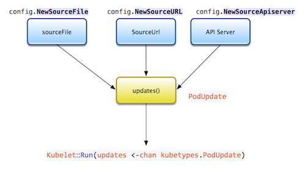

# kubelet 源码分析

[TOC]

代码基于 1.6 版本

## 1. kubelet 整体流程

k8s.io/kubernetes/cmd/kubelet/kubelet.go

```go
func main() {
	// ...

	if err := app.Run(s, nil); err != nil {
		fmt.Fprintf(os.Stderr, "error: %v\n", err)
		os.Exit(1)
	}
}
```

k8s.io/kubernetes/cmd/kubelet/app/server.go

```go
// Run runs the specified KubeletServer with the given KubeletDeps.  This should never exit.
// The kubeDeps argument may be nil - if so, it is initialized from the settings on KubeletServer.
// Otherwise, the caller is assumed to have set up the KubeletDeps object and a default one will
// not be generated.
func Run(s *options.KubeletServer, kubeDeps *kubelet.KubeletDeps) error {
	if err := run(s, kubeDeps); err != nil {
		return fmt.Errorf("failed to run Kubelet: %v", err)
	}
	return nil
}


func run(s *options.KubeletServer, kubeDeps *kubelet.KubeletDeps) (err error) {
	/*kubeDeps = nil*/
	// ...
	done := make(chan struct{})

  	// ...
	// Validate configuration.
	if err := validateConfig(s); err != nil {
		return err
	}

	nodeName, err := getNodeName(kubeDeps.Cloud, nodeutil.GetHostname(s.HostnameOverride))

	// Setup event recorder if required.
	makeEventRecorder(&s.KubeletConfiguration, kubeDeps, nodeName)

	if kubeDeps.ContainerManager == nil {
         // ...
		kubeDeps.ContainerManager, err = cm.NewContainerManager(
			kubeDeps.Mounter,
			kubeDeps.CAdvisorInterface,
			cm.NodeConfig{
				RuntimeCgroupsName:    s.RuntimeCgroups,
				SystemCgroupsName:     s.SystemCgroups,
				KubeletCgroupsName:    s.KubeletCgroups,
				ContainerRuntime:      s.ContainerRuntime,
				CgroupsPerQOS:         s.CgroupsPerQOS,
				CgroupRoot:            s.CgroupRoot,
				CgroupDriver:          s.CgroupDriver,
				ProtectKernelDefaults: s.ProtectKernelDefaults,
				NodeAllocatableConfig: cm.NodeAllocatableConfig{
					KubeReservedCgroupName:   s.KubeReservedCgroup,
					SystemReservedCgroupName: s.SystemReservedCgroup,
					EnforceNodeAllocatable:   sets.NewString(s.EnforceNodeAllocatable...),
					KubeReserved:             kubeReserved,
					SystemReserved:           systemReserved,
					HardEvictionThresholds:   hardEvictionThresholds,
				},
				ExperimentalQOSReserved: *experimentalQOSReserved,
			},
			s.ExperimentalFailSwapOn,
			kubeDeps.Recorder)
	}
  
  	// ....

	RunKubelet(&s.KubeletFlags, &s.KubeletConfiguration, kubeDeps, s.RunOnce, standaloneMode); 
	
	<-done
	return nil
}
```

```go
func RunKubelet(kubeFlags *options.KubeletFlags, kubeCfg *componentconfig.KubeletConfiguration, kubeDeps *kubelet.KubeletDeps, runOnce bool, standaloneMode bool) error {
	hostname := nodeutil.GetHostname(kubeFlags.HostnameOverride)
	// Query the cloud provider for our node name, default to hostname if kcfg.Cloud == nil
	nodeName, err := getNodeName(kubeDeps.Cloud, hostname)
  
	// Setup event recorder if required.
	makeEventRecorder(kubeCfg, kubeDeps, nodeName)
  
	hostNetworkSources, err := kubetypes.GetValidatedSources(kubeCfg.HostNetworkSources)
	hostPIDSources, err := kubetypes.GetValidatedSources(kubeCfg.HostPIDSources)
	hostIPCSources, err := kubetypes.GetValidatedSources(kubeCfg.HostIPCSources)

	privilegedSources := capabilities.PrivilegedSources{
		HostNetworkSources: hostNetworkSources,
		HostPIDSources:     hostPIDSources,
		HostIPCSources:     hostIPCSources,
	}
  
	capabilities.Setup(kubeCfg.AllowPrivileged, privilegedSources, 0)
	credentialprovider.SetPreferredDockercfgPath(kubeCfg.RootDirectory)

	builder := kubeDeps.Builder
	if builder == nil {
		builder = CreateAndInitKubelet // 重点分析
	}
  
	if kubeDeps.OSInterface == nil {
		kubeDeps.OSInterface = kubecontainer.RealOS{}
	}
  
    // 调用 CreateAndInitKubelet 完成 kubelet.KubeletBootstrap 的创建
	k, err := builder(kubeCfg, kubeDeps, &kubeFlags.ContainerRuntimeOptions, standaloneMode, kubeFlags.HostnameOverride, kubeFlags.NodeIP, kubeFlags.ProviderID)

	podCfg := kubeDeps.PodConfig
  	
  	//...
	startKubelet(k, podCfg, kubeCfg, kubeDeps)
}
```

```go
func startKubelet(k kubelet.KubeletBootstrap, podCfg *config.PodConfig, kubeCfg *componentconfig.KubeletConfiguration, kubeDeps *kubelet.KubeletDeps) {
	// start the kubelet
	go wait.Until(func() { k.Run(podCfg.Updates()) }, 0, wait.NeverStop)

	// start the kubelet server， 主要提供给API Server 访问相关信息
	if kubeCfg.EnableServer {
		go wait.Until(func() {
			k.ListenAndServe(net.ParseIP(kubeCfg.Address), uint(kubeCfg.Port), kubeDeps.TLSOptions, kubeDeps.Auth, kubeCfg.EnableDebuggingHandlers, kubeCfg.EnableContentionProfiling)
		}, 0, wait.NeverStop)
	}
  
	if kubeCfg.ReadOnlyPort > 0 {
		go wait.Until(func() {
			k.ListenAndServeReadOnly(net.ParseIP(kubeCfg.Address), uint(kubeCfg.ReadOnlyPort))
		}, 0, wait.NeverStop)
	}
}
```

创建kubelet并初始化相关工作

```go
func CreateAndInitKubelet(kubeCfg *componentconfig.KubeletConfiguration, kubeDeps *kubelet.KubeletDeps, crOptions *options.ContainerRuntimeOptions, standaloneMode bool, hostnameOverride, nodeIP, providerID string) (k kubelet.KubeletBootstrap, err error) {
	// TODO: block until all sources have delivered at least one update to the channel, or break the sync loop
	// up into "per source" synchronizations
	
	// NewMainKubelet 完成对象的创建，非常长的一个函数
	k, err = kubelet.NewMainKubelet(kubeCfg, kubeDeps, crOptions, standaloneMode, hostnameOverride, nodeIP, providerID)
	if err != nil {
		return nil, err
	}
	// 事件通知
	k.BirthCry()
  
    // 启动垃圾回收相关工作
	k.StartGarbageCollection()

	return k, nil
}
```


## 2. kubelet  NewMainKubelet

k8s.io/kubernetes/pkg/kubelet/kubelet.go

```go
// NewMainKubelet instantiates a new Kubelet object along with all the required internal modules.
// No initialization of Kubelet and its modules should happen here.
func NewMainKubelet(kubeCfg *componentconfig.KubeletConfiguration, kubeDeps *KubeletDeps, crOptions *options.ContainerRuntimeOptions, standaloneMode bool, hostnameOverride, nodeIP, providerID string) (*Kubelet, error){

	if kubeDeps.PodConfig == nil {
		var err error
		kubeDeps.PodConfig, err = makePodSourceConfig(kubeCfg, kubeDeps, nodeName)

	  // ...
      klet.statusManager = status.NewManager(klet.kubeClient, klet.podManager, klet)
      
      // ...
      klet.podWorkers = newPodWorkers(klet.syncPod, kubeDeps.Recorder, klet.workQueue, klet.resyncInterval, backOffPeriod, klet.podCache)
      
     // ...
}
```

k8s.io/kubernetes/pkg/kubelet/kubelet.go

```go
// makePodSourceConfig creates a config.PodConfig from the given
// KubeletConfiguration or returns an error.
func makePodSourceConfig(kubeCfg *componentconfig.KubeletConfiguration, kubeDeps *KubeletDeps, nodeName types.NodeName) (*config.PodConfig, error) {
	// ...

	// source of all configuration
	cfg := config.NewPodConfig(config.PodConfigNotificationIncremental, kubeDeps.Recorder)

	// define file config source
	if kubeCfg.PodManifestPath != "" {
		config.NewSourceFile(kubeCfg.PodManifestPath, nodeName, kubeCfg.FileCheckFrequency.Duration, cfg.Channel(kubetypes.FileSource))
	}

	// define url config source
	if kubeCfg.ManifestURL != "" {
		config.NewSourceURL(kubeCfg.ManifestURL, manifestURLHeader, nodeName, kubeCfg.HTTPCheckFrequency.Duration, cfg.Channel(kubetypes.HTTPSource))
	}
  
	if kubeDeps.KubeClient != nil {
		config.NewSourceApiserver(kubeDeps.KubeClient, nodeName, cfg.Channel(kubetypes.ApiserverSource))
	}
  
	return cfg, nil
}
```
### 2.1 PodConfig

k8s.io/kubernetes/pkg/kubelet/config/config.go

```go
// PodConfig is a configuration mux that merges many sources of pod configuration into a single
// consistent structure, and then delivers incremental change notifications to listeners
// in order.
type PodConfig struct {
	pods *podStorage
	mux  *config.Mux		// 保存汇入的各个 channel

	// the channel of denormalized changes passed to listeners
	updates chan kubetypes.PodUpdate  // 对外暴露的channel

	// contains the list of all configured sources
	sourcesLock sync.Mutex
	sources     sets.String
}

// Mux is a class for merging configuration from multiple sources.  Changes are
// pushed via channels and sent to the merge function.
type Mux struct {
	// Invoked when an update is sent to a source.
	merger Merger

	// Sources and their lock.
	sourceLock sync.RWMutex
	// Maps source names to channels
	sources map[string]chan interface{}
}
```




### 2.2 kubelet 结构

NewMainKubelet() 函数中主要就是根据配置设置好 kubelet 结构中的各字段。

```go
// Kubelet is the main kubelet implementation.
type Kubelet struct {
	kubeletConfiguration componentconfig.KubeletConfiguration

	hostname      string
	nodeName      types.NodeName
	runtimeCache  kubecontainer.RuntimeCache
	kubeClient    clientset.Interface
	iptClient     utilipt.Interface
	rootDirectory string

	// podWorkers handle syncing Pods in response to events.
	podWorkers PodWorkers

	// resyncInterval is the interval between periodic full reconciliations of
	// pods on this node.
	resyncInterval time.Duration

	// sourcesReady records the sources seen by the kubelet, it is thread-safe.
	sourcesReady config.SourcesReady

	// podManager is a facade that abstracts away the various sources of pods
	// this Kubelet services.
	podManager kubepod.Manager

	// Needed to observe and respond to situations that could impact node stability
	evictionManager eviction.Manager

	// Optional, defaults to /logs/ from /var/log
	logServer http.Handler
	// Optional, defaults to simple Docker implementation
	runner kubecontainer.ContainerCommandRunner

	// cAdvisor used for container information.
	cadvisor cadvisor.Interface

	// Set to true to have the node register itself with the apiserver.
	registerNode bool
	// Set to true to have the node register itself as schedulable.
	registerSchedulable bool
	// for internal book keeping; access only from within registerWithApiserver
	registrationCompleted bool

	// Set to true if the kubelet is in standalone mode (i.e. setup without an apiserver)
	standaloneMode bool

	// If non-empty, use this for container DNS search.
	clusterDomain string

	// If non-nil, use this for container DNS server.
	clusterDNS []net.IP

	// masterServiceNamespace is the namespace that the master service is exposed in.
	masterServiceNamespace string
	// serviceLister knows how to list services
	serviceLister serviceLister
	// nodeInfo knows how to get information about the node for this kubelet.
	nodeInfo predicates.NodeInfo

	// a list of node labels to register
	nodeLabels map[string]string

	// Last timestamp when runtime responded on ping.
	// Mutex is used to protect this value.
	runtimeState *runtimeState

	// Volume plugins.
	volumePluginMgr *volume.VolumePluginMgr

	// Network plugin.
	networkPlugin network.NetworkPlugin

	// Handles container probing.
	probeManager prober.Manager
	// Manages container health check results.
	livenessManager proberesults.Manager

	// How long to keep idle streaming command execution/port forwarding
	// connections open before terminating them
	streamingConnectionIdleTimeout time.Duration

	// The EventRecorder to use
	recorder record.EventRecorder

	// Policy for handling garbage collection of dead containers.
	containerGC kubecontainer.ContainerGC

	// Manager for image garbage collection.
	imageManager images.ImageGCManager

	// Diskspace manager.
	diskSpaceManager diskSpaceManager

	// Secret manager.
	secretManager secret.Manager

	// Cached MachineInfo returned by cadvisor.
	machineInfo *cadvisorapi.MachineInfo

	// Handles certificate rotations.
	serverCertificateManager certificate.Manager

	// Syncs pods statuses with apiserver; also used as a cache of statuses.
	statusManager status.Manager

	// VolumeManager runs a set of asynchronous loops that figure out which
	// volumes need to be attached/mounted/unmounted/detached based on the pods
	// scheduled on this node and makes it so.
	volumeManager volumemanager.VolumeManager

	// Cloud provider interface.
	cloud                   cloudprovider.Interface
	autoDetectCloudProvider bool
	// Indicates that the node initialization happens in an external cloud controller
	externalCloudProvider bool
	// Reference to this node.
	nodeRef *clientv1.ObjectReference

	// Container runtime.
	containerRuntime kubecontainer.Runtime

	// reasonCache caches the failure reason of the last creation of all containers, which is
	// used for generating ContainerStatus.
	reasonCache *ReasonCache

	// nodeStatusUpdateFrequency specifies how often kubelet posts node status to master.
	// Note: be cautious when changing the constant, it must work with nodeMonitorGracePeriod
	// in nodecontroller. There are several constraints:
	// 1. nodeMonitorGracePeriod must be N times more than nodeStatusUpdateFrequency, where
	//    N means number of retries allowed for kubelet to post node status. It is pointless
	//    to make nodeMonitorGracePeriod be less than nodeStatusUpdateFrequency, since there
	//    will only be fresh values from Kubelet at an interval of nodeStatusUpdateFrequency.
	//    The constant must be less than podEvictionTimeout.
	// 2. nodeStatusUpdateFrequency needs to be large enough for kubelet to generate node
	//    status. Kubelet may fail to update node status reliably if the value is too small,
	//    as it takes time to gather all necessary node information.
	nodeStatusUpdateFrequency time.Duration

	// Generates pod events.
	pleg pleg.PodLifecycleEventGenerator

	// Store kubecontainer.PodStatus for all pods.
	podCache kubecontainer.Cache

	// os is a facade for various syscalls that need to be mocked during testing.
	os kubecontainer.OSInterface

	// Watcher of out of memory events.
	oomWatcher OOMWatcher

	// Monitor resource usage
	resourceAnalyzer stats.ResourceAnalyzer

	// Whether or not we should have the QOS cgroup hierarchy for resource management
	cgroupsPerQOS bool

	// If non-empty, pass this to the container runtime as the root cgroup.
	cgroupRoot string

	// Mounter to use for volumes.
	mounter mount.Interface

	// Writer interface to use for volumes.
	writer kubeio.Writer

	// Manager of non-Runtime containers.
	containerManager cm.ContainerManager

	// Maximum Number of Pods which can be run by this Kubelet
	maxPods int

	// Monitor Kubelet's sync loop
	syncLoopMonitor atomic.Value

	// Container restart Backoff
	backOff *flowcontrol.Backoff

	// Channel for sending pods to kill.
	podKillingCh chan *kubecontainer.PodPair

	// The configuration file used as the base to generate the container's
	// DNS resolver configuration file. This can be used in conjunction with
	// clusterDomain and clusterDNS.
	resolverConfig string

	// Optionally shape the bandwidth of a pod
	// TODO: remove when kubenet plugin is ready
	shaper bandwidth.BandwidthShaper

	// Information about the ports which are opened by daemons on Node running this Kubelet server.
	daemonEndpoints *v1.NodeDaemonEndpoints

	// A queue used to trigger pod workers.
	workQueue queue.WorkQueue

	// oneTimeInitializer is used to initialize modules that are dependent on the runtime to be up.
	oneTimeInitializer sync.Once

	// If non-nil, use this IP address for the node
	nodeIP net.IP

	// If non-nil, this is a unique identifier for the node in an external database, eg. cloudprovider
	providerID string

	// clock is an interface that provides time related functionality in a way that makes it
	// easy to test the code.
	clock clock.Clock

	// outOfDiskTransitionFrequency specifies the amount of time the kubelet has to be actually
	// not out of disk before it can transition the node condition status from out-of-disk to
	// not-out-of-disk. This prevents a pod that causes out-of-disk condition from repeatedly
	// getting rescheduled onto the node.
	outOfDiskTransitionFrequency time.Duration

	// handlers called during the tryUpdateNodeStatus cycle
	setNodeStatusFuncs []func(*v1.Node) error

	// TODO: think about moving this to be centralized in PodWorkers in follow-on.
	// the list of handlers to call during pod admission.
	admitHandlers lifecycle.PodAdmitHandlers

	// softAdmithandlers are applied to the pod after it is admitted by the Kubelet, but before it is
	// run. A pod rejected by a softAdmitHandler will be left in a Pending state indefinitely. If a
	// rejected pod should not be recreated, or the scheduler is not aware of the rejection rule, the
	// admission rule should be applied by a softAdmitHandler.
	softAdmitHandlers lifecycle.PodAdmitHandlers

	// the list of handlers to call during pod sync loop.
	lifecycle.PodSyncLoopHandlers

	// the list of handlers to call during pod sync.
	lifecycle.PodSyncHandlers

	// the number of allowed pods per core
	podsPerCore int

	// enableControllerAttachDetach indicates the Attach/Detach controller
	// should manage attachment/detachment of volumes scheduled to this node,
	// and disable kubelet from executing any attach/detach operations
	enableControllerAttachDetach bool

	// trigger deleting containers in a pod
	containerDeletor *podContainerDeletor

	// config iptables util rules
	makeIPTablesUtilChains bool

	// The bit of the fwmark space to mark packets for SNAT.
	iptablesMasqueradeBit int

	// The bit of the fwmark space to mark packets for dropping.
	iptablesDropBit int

	// The AppArmor validator for checking whether AppArmor is supported.
	appArmorValidator apparmor.Validator

	// The handler serving CRI streaming calls (exec/attach/port-forward).
	criHandler http.Handler

	// experimentalHostUserNamespaceDefaulting sets userns=true when users request host namespaces (pid, ipc, net),
	// are using non-namespaced capabilities (mknod, sys_time, sys_module), the pod contains a privileged container,
	// or using host path volumes.
	// This should only be enabled when the container runtime is performing user remapping AND if the
	// experimental behavior is desired.
	experimentalHostUserNamespaceDefaulting bool

	// GPU Manager
	gpuManager gpu.GPUManager

	// dockerLegacyService contains some legacy methods for backward compatibility.
	// It should be set only when docker is using non json-file logging driver.
	dockerLegacyService dockershim.DockerLegacyService
}
```

## 3. kubelet  Run()

k8s.io/kubernetes/pkg/kubelet/kubelet.go

```go
// Run starts the kubelet reacting to config updates
func (kl *Kubelet) Run(updates <-chan kubetypes.PodUpdate) {
   if kl.logServer == nil {
      kl.logServer = http.StripPrefix("/logs/", http.FileServer(http.Dir("/var/log/")))
   }
   if kl.kubeClient == nil {
      glog.Warning("No api server defined - no node status update will be sent.")
   }

   if err := kl.initializeModules(); err != nil {
      kl.recorder.Eventf(kl.nodeRef, v1.EventTypeWarning, events.KubeletSetupFailed, err.Error())
      glog.Error(err)
      kl.runtimeState.setInitError(err)
   }

   // Start volume manager
   go kl.volumeManager.Run(kl.sourcesReady, wait.NeverStop)

   if kl.kubeClient != nil {
      // Start syncing node status immediately, this may set up things the runtime needs to run.
      go wait.Until(kl.syncNodeStatus, kl.nodeStatusUpdateFrequency, wait.NeverStop)
   }
  
   go wait.Until(kl.syncNetworkStatus, 30*time.Second, wait.NeverStop)
   go wait.Until(kl.updateRuntimeUp, 5*time.Second, wait.NeverStop)

   // Start loop to sync iptables util rules
   if kl.makeIPTablesUtilChains {
      go wait.Until(kl.syncNetworkUtil, 1*time.Minute, wait.NeverStop)
   }

   // Start a goroutine responsible for killing pods (that are not properly
   // handled by pod workers).
   go wait.Until(kl.podKiller, 1*time.Second, wait.NeverStop)

   // Start gorouting responsible for checking limits in resolv.conf
   if kl.resolverConfig != "" {
      go wait.Until(func() { kl.checkLimitsForResolvConf() }, 30*time.Second, wait.NeverStop)
   }

   // Start component sync loops.
   kl.statusManager.Start()
   kl.probeManager.Start()

   // Start the pod lifecycle event generator.
   kl.pleg.Start()
   kl.syncLoop(updates, kl)   // kubelet核心函数
}
```

```go
// syncLoop is the main loop for processing changes. It watches for changes from
// three channels (file, apiserver, and http) and creates a union of them. For
// any new change seen, will run a sync against desired state and running state. If
// no changes are seen to the configuration, will synchronize the last known desired
// state every sync-frequency seconds. Never returns.
func (kl *Kubelet) syncLoop(updates <-chan kubetypes.PodUpdate, handler SyncHandler) {
	glog.Info("Starting kubelet main sync loop.")
	// The resyncTicker wakes up kubelet to checks if there are any pod workers
	// that need to be sync'd. A one-second period is sufficient because the
	// sync interval is defaulted to 10s.
	syncTicker := time.NewTicker(time.Second)
	defer syncTicker.Stop()
	housekeepingTicker := time.NewTicker(housekeepingPeriod)
	defer housekeepingTicker.Stop()
	plegCh := kl.pleg.Watch()
	for {
		if rs := kl.runtimeState.runtimeErrors(); len(rs) != 0 {
			glog.Infof("skipping pod synchronization - %v", rs)
			time.Sleep(5 * time.Second)
			continue
		}
		if !kl.syncLoopIteration(updates, handler, syncTicker.C, housekeepingTicker.C, plegCh) {
			break
		}
	}
}

// SyncHandler is an interface implemented by Kubelet, for testability
type SyncHandler interface {
	HandlePodAdditions(pods []*v1.Pod)
	HandlePodUpdates(pods []*v1.Pod)
	HandlePodRemoves(pods []*v1.Pod)
	HandlePodReconcile(pods []*v1.Pod)
	HandlePodSyncs(pods []*v1.Pod)
	HandlePodCleanups() error
}
```

```go
// syncLoopIteration reads from various channels and dispatches pods to the
// given handler.
//
// Arguments:
// 1.  configCh:       a channel to read config events from // updates
// 2.  handler:        the SyncHandler to dispatch pods to  // SyncHandler
// 3.  syncCh:         a channel to read periodic sync events from
// 4.  houseKeepingCh: a channel to read housekeeping events from
// 5.  plegCh:         a channel to read PLEG updates from
//
// Events are also read from the kubelet liveness manager's update channel.
//
// The workflow is to read from one of the channels, handle that event, and
// update the timestamp in the sync loop monitor.
//
// Here is an appropriate place to note that despite the syntactical
// similarity to the switch statement, the case statements in a select are
// evaluated in a pseudorandom order if there are multiple channels ready to
// read from when the select is evaluated.  In other words, case statements
// are evaluated in random order, and you can not assume that the case
// statements evaluate in order if multiple channels have events.
//
// With that in mind, in truly no particular order, the different channels
// are handled as follows:
//
// * configCh: dispatch the pods for the config change to the appropriate
//             handler callback for the event type
// * plegCh: update the runtime cache; sync pod
// * syncCh: sync all pods waiting for sync
// * houseKeepingCh: trigger cleanup of pods
// * liveness manager: sync pods that have failed or in which one or more
//                     containers have failed liveness checks
func (kl *Kubelet) syncLoopIteration(configCh <-chan kubetypes.PodUpdate, handler SyncHandler,
	syncCh <-chan time.Time, housekeepingCh <-chan time.Time, plegCh <-chan *pleg.PodLifecycleEvent) bool {
	kl.syncLoopMonitor.Store(kl.clock.Now())
	select {
	case u, open := <-configCh:
		// Update from a config source; dispatch it to the right handler
		// callback.
		switch u.Op {
		case kubetypes.ADD:
			// After restarting, kubelet will get all existing pods through
			// ADD as if they are new pods. These pods will then go through the
			// admission process and *may* be rejected. This can be resolved
			// once we have checkpointing.
			handler.HandlePodAdditions(u.Pods)  // 接着讲解流程
		case kubetypes.UPDATE:
			handler.HandlePodUpdates(u.Pods)
		case kubetypes.REMOVE:
			handler.HandlePodRemoves(u.Pods)
		case kubetypes.RECONCILE:
			handler.HandlePodReconcile(u.Pods)
		case kubetypes.DELETE:
			// DELETE is treated as a UPDATE because of graceful deletion.
			handler.HandlePodUpdates(u.Pods)
		}

		// Mark the source ready after receiving at least one update from the
		// source. Once all the sources are marked ready, various cleanup
		// routines will start reclaiming resources. It is important that this
		// takes place only after kubelet calls the update handler to process
		// the update to ensure the internal pod cache is up-to-date.
		kl.sourcesReady.AddSource(u.Source)
	case e := <-plegCh:
		if isSyncPodWorthy(e) {
			// PLEG event for a pod; sync it.
			if pod, ok := kl.podManager.GetPodByUID(e.ID); ok {
				glog.V(2).Infof("SyncLoop (PLEG): %q, event: %#v", format.Pod(pod), e)
				handler.HandlePodSyncs([]*v1.Pod{pod})
			} else {
				// If the pod no longer exists, ignore the event.
				glog.V(4).Infof("SyncLoop (PLEG): ignore irrelevant event: %#v", e)
			}
		}

		if e.Type == pleg.ContainerDied {
			if containerID, ok := e.Data.(string); ok {
				kl.cleanUpContainersInPod(e.ID, containerID)
			}
		}
	case <-syncCh:
		// Sync pods waiting for sync
		podsToSync := kl.getPodsToSync()
		if len(podsToSync) == 0 {
			break
		}
		glog.V(4).Infof("SyncLoop (SYNC): %d pods; %s", len(podsToSync), format.Pods(podsToSync))
		kl.HandlePodSyncs(podsToSync)
	case update := <-kl.livenessManager.Updates():
		if update.Result == proberesults.Failure {
			// The liveness manager detected a failure; sync the pod.

			// We should not use the pod from livenessManager, because it is never updated after
			// initialization.
			pod, ok := kl.podManager.GetPodByUID(update.PodUID)
			if !ok {
				// If the pod no longer exists, ignore the update.
				break
			}
			handler.HandlePodSyncs([]*v1.Pod{pod})
		}
	case <-housekeepingCh:
		if !kl.sourcesReady.AllReady() {
			// If the sources aren't ready or volume manager has not yet synced the states,
			// skip housekeeping, as we may accidentally delete pods from unready sources.
			glog.V(4).Infof("SyncLoop (housekeeping, skipped): sources aren't ready yet.")
		} else {
			err := handler.HandlePodCleanups()
		}
	}
	kl.syncLoopMonitor.Store(kl.clock.Now())
	return true
}
```


> Kubelet automatically creates so-called *mirror pod* on Kubernetes API server for each static pod, so the pods are visible there, but they cannot be controlled from the API server.

```go
// HandlePodAdditions is the callback in SyncHandler for pods being added from
// a config source.
func (kl *Kubelet) HandlePodAdditions(pods []*v1.Pod) {
	start := kl.clock.Now()
	sort.Sort(sliceutils.PodsByCreationTime(pods))
	for _, pod := range pods {
      	// k8s.io/kubernetes/pkg/kubelet/pod/pod_manager.go
        // NewBasicPodManager(client MirrorClient, secretManager secret.Manager) Manager
        // basicManager
		existingPods := kl.podManager.GetPods()
		// Always add the pod to the pod manager. Kubelet relies on the pod
		// manager as the source of truth for the desired state. If a pod does
		// not exist in the pod manager, it means that it has been deleted in
		// the apiserver and no action (other than cleanup) is required.
		kl.podManager.AddPod(pod)

		if kubepod.IsMirrorPod(pod) {
			kl.handleMirrorPod(pod, start)
			continue
		}

		if !kl.podIsTerminated(pod) {
			// We failed pods that we rejected, so activePods include all admitted
			// pods that are alive.
			activePods := kl.filterOutTerminatedPods(existingPods)

			// Check if we can admit the pod; if not, reject it.
			if ok, reason, message := kl.canAdmitPod(activePods, pod); !ok {
				kl.rejectPod(pod, reason, message)
				continue
			}
		}
		mirrorPod, _ := kl.podManager.GetMirrorPodByPod(pod)
		kl.dispatchWork(pod, kubetypes.SyncPodCreate, mirrorPod, start) // 进行分发
		
		// 处理probe相关的检测
		kl.probeManager.AddPod(pod) // Handles container probing.
	}
}
```


```go
// dispatchWork starts the asynchronous sync of the pod in a pod worker.
// If the pod is terminated, dispatchWork
func (kl *Kubelet) dispatchWork(pod *v1.Pod, syncType kubetypes.SyncPodType, mirrorPod *v1.Pod, start time.Time) {
	// ...
	// Run the sync in an async worker.
	kl.podWorkers.UpdatePod(&UpdatePodOptions{
		Pod:        pod,
		MirrorPod:  mirrorPod,
		UpdateType: syncType,
		OnCompleteFunc: func(err error) {
			if err != nil {
				metrics.PodWorkerLatency.WithLabelValues(syncType.String()).Observe(metrics.SinceInMicroseconds(start))
			}
		},
	})
	// Note the number of containers for new pods.
	if syncType == kubetypes.SyncPodCreate {
		metrics.ContainersPerPodCount.Observe(float64(len(pod.Spec.Containers)))
	}
}
```

k8s.io/kubernetes/pkg/kubelet/pod_workers.go
```go
type podWorkers struct {
	// Protects all per worker fields.
	podLock sync.Mutex

	// Tracks all running per-pod goroutines - per-pod goroutine will be
	// processing updates received through its corresponding channel.
	podUpdates map[types.UID]chan UpdatePodOptions
	// Track the current state of per-pod goroutines.
	// Currently all update request for a given pod coming when another
	// update of this pod is being processed are ignored.
	isWorking map[types.UID]bool
	// Tracks the last undelivered work item for this pod - a work item is
	// undelivered if it comes in while the worker is working.
	lastUndeliveredWorkUpdate map[types.UID]UpdatePodOptions

	workQueue queue.WorkQueue

	// This function is run to sync the desired stated of pod.
	// NOTE: This function has to be thread-safe - it can be called for
	// different pods at the same time.
	syncPodFn syncPodFnType

	// The EventRecorder to use
	recorder record.EventRecorder

	// backOffPeriod is the duration to back off when there is a sync error.
	backOffPeriod time.Duration

	// resyncInterval is the duration to wait until the next sync.
	resyncInterval time.Duration

	// podCache stores kubecontainer.PodStatus for all pods.
	podCache kubecontainer.Cache
}
```


```go
// Apply the new setting to the specified pod.
// If the options provide an OnCompleteFunc, the function is invoked if the update is accepted.
// Update requests are ignored if a kill pod request is pending.
func (p *podWorkers) UpdatePod(options *UpdatePodOptions) {
	pod := options.Pod
	uid := pod.UID
	var podUpdates chan UpdatePodOptions
	var exists bool

	p.podLock.Lock()
	defer p.podLock.Unlock()
	if podUpdates, exists = p.podUpdates[uid]; !exists {
		// We need to have a buffer here, because checkForUpdates() method that
		// puts an update into channel is called from the same goroutine where
		// the channel is consumed. However, it is guaranteed that in such case
		// the channel is empty, so buffer of size 1 is enough.
		podUpdates = make(chan UpdatePodOptions, 1)
		p.podUpdates[uid] = podUpdates

		// Creating a new pod worker either means this is a new pod, or that the
		// kubelet just restarted. In either case the kubelet is willing to believe
		// the status of the pod for the first pod worker sync. See corresponding
		// comment in syncPod.
		go func() {
			defer runtime.HandleCrash()
			p.managePodLoop(podUpdates)
		}()
	}
	if !p.isWorking[pod.UID] {
		p.isWorking[pod.UID] = true
		podUpdates <- *options
	} else {
		// if a request to kill a pod is pending, we do not let anything overwrite that request.
		update, found := p.lastUndeliveredWorkUpdate[pod.UID]
		if !found || update.UpdateType != kubetypes.SyncPodKill {
			p.lastUndeliveredWorkUpdate[pod.UID] = *options
		}
	}
}

func (p *podWorkers) managePodLoop(podUpdates <-chan UpdatePodOptions) {
	var lastSyncTime time.Time
	for update := range podUpdates {
		err := func() error {
			podUID := update.Pod.UID
			// This is a blocking call that would return only if the cache
			// has an entry for the pod that is newer than minRuntimeCache
			// Time. This ensures the worker doesn't start syncing until
			// after the cache is at least newer than the finished time of
			// the previous sync.
			status, err := p.podCache.GetNewerThan(podUID, lastSyncTime)
			if err != nil {
				return err
			}
			err = p.syncPodFn(syncPodOptions{
				mirrorPod:      update.MirrorPod,
				pod:            update.Pod,
				podStatus:      status,
				killPodOptions: update.KillPodOptions,
				updateType:     update.UpdateType,
			})
			lastSyncTime = time.Now()
			return err
		}()
		// notify the call-back function if the operation succeeded or not
		if update.OnCompleteFunc != nil {
			update.OnCompleteFunc(err)
		}
		if err != nil {
			glog.Errorf("Error syncing pod %s (%q), skipping: %v", update.Pod.UID, format.Pod(update.Pod), err)
			p.recorder.Eventf(update.Pod, v1.EventTypeWarning, events.FailedSync, "Error syncing pod, skipping: %v", err)
		}
		p.wrapUp(update.Pod.UID, err)
	}
}

// klet.podWorkers = newPodWorkers(klet.syncPod, kubeDeps.Recorder, klet.workQueue, klet.resyncInterval, backOffPeriod, klet.podCache)
func newPodWorkers(syncPodFn syncPodFnType, recorder record.EventRecorder, workQueue queue.WorkQueue,
	resyncInterval, backOffPeriod time.Duration, podCache kubecontainer.Cache) *podWorkers {
	return &podWorkers{
		podUpdates:                map[types.UID]chan UpdatePodOptions{},
		isWorking:                 map[types.UID]bool{},
		lastUndeliveredWorkUpdate: map[types.UID]UpdatePodOptions{},
		syncPodFn:                 syncPodFn, // kubelet.syncPod()
		recorder:                  recorder,
		workQueue:                 workQueue,
		resyncInterval:            resyncInterval,
		backOffPeriod:             backOffPeriod,
		podCache:                  podCache,
	}
}
```

## 4. Kublet syncPod()

```go
// syncPod is the transaction script for the sync of a single pod.
//
// Arguments:
//
// o - the SyncPodOptions for this invocation
//
// The workflow is:
// * If the pod is being created, record pod worker start latency
// * Call generateAPIPodStatus to prepare an v1.PodStatus for the pod
// * If the pod is being seen as running for the first time, record pod
//   start latency
// * Update the status of the pod in the status manager
// * Kill the pod if it should not be running
// * Create a mirror pod if the pod is a static pod, and does not
//   already have a mirror pod
// * Create the data directories for the pod if they do not exist
// * Wait for volumes to attach/mount
// * Fetch the pull secrets for the pod
// * Call the container runtime's SyncPod callback
// * Update the traffic shaping for the pod's ingress and egress limits
//
// If any step of this workflow errors, the error is returned, and is repeated
// on the next syncPod call.
func (kl *Kubelet) syncPod(o syncPodOptions) error {
	// pull out the required options
	pod := o.pod
	mirrorPod := o.mirrorPod
	podStatus := o.podStatus
	updateType := o.updateType

	// if we want to kill a pod, do it now!
	// ...

	// Latency measurements for the main workflow are relative to the
	// first time the pod was seen by the API server.
	var firstSeenTime time.Time
	if firstSeenTimeStr, ok := pod.Annotations[kubetypes.ConfigFirstSeenAnnotationKey]; ok {
		firstSeenTime = kubetypes.ConvertToTimestamp(firstSeenTimeStr).Get()
	}

	// Record pod worker start latency if being created
  	// ...

	// Generate final API pod status with pod and status manager status
	apiPodStatus := kl.generateAPIPodStatus(pod, podStatus)
	// The pod IP may be changed in generateAPIPodStatus if the pod is using host network. (See #24576)
	// TODO(random-liu): After writing pod spec into container labels, check whether pod is using host network, and
	// set pod IP to hostIP directly in runtime.GetPodStatus
	podStatus.IP = apiPodStatus.PodIP

	// Record the time it takes for the pod to become running.
	existingStatus, ok := kl.statusManager.GetPodStatus(pod.UID)
	if !ok || existingStatus.Phase == v1.PodPending && apiPodStatus.Phase == v1.PodRunning &&
		!firstSeenTime.IsZero() {
		metrics.PodStartLatency.Observe(metrics.SinceInMicroseconds(firstSeenTime))
	}

	runnable := kl.canRunPod(pod)
	// ...
	// Update status in the status manager
    // 将 pod 的变化状态信息放入到 statusManager， 用于同步到 API Server
	kl.statusManager.SetPodStatus(pod, apiPodStatus)

	// Kill pod if it should not be running
	// ....

	// If the network plugin is not ready, only start the pod if it uses the host network
	// Create Cgroups for the pod and apply resource parameters
	// to them if cgroups-per-qos flag is enabled.
	pcm := kl.containerManager.NewPodContainerManager()
	// If pod has already been terminated then we need not create
	// or update the pod's cgroup
	if !kl.podIsTerminated(pod) {
		// When the kubelet is restarted with the cgroups-per-qos
		// flag enabled, all the pod's running containers
		// should be killed intermittently and brought back up
		// under the qos cgroup hierarchy.
		// Check if this is the pod's first sync
		firstSync := true
		for _, containerStatus := range apiPodStatus.ContainerStatuses {
			if containerStatus.State.Running != nil {
				firstSync = false
				break
			}
		}
		// Don't kill containers in pod if pod's cgroups already
		// exists or the pod is running for the first time
		podKilled := false
		if !pcm.Exists(pod) && !firstSync {
			if err := kl.killPod(pod, nil, podStatus, nil); err == nil {
				podKilled = true
			}
		}
		// Create and Update pod's Cgroups
		// Don't create cgroups for run once pod if it was killed above
		// The current policy is not to restart the run once pods when
		// the kubelet is restarted with the new flag as run once pods are
		// expected to run only once and if the kubelet is restarted then
		// they are not expected to run again.
		// We don't create and apply updates to cgroup if its a run once pod and was killed above
		if !(podKilled && pod.Spec.RestartPolicy == v1.RestartPolicyNever) {
			if !pcm.Exists(pod) {
				if err := kl.containerManager.UpdateQOSCgroups(); err != nil {
					glog.V(2).Infof("Failed to update QoS cgroups while syncing pod: %v", err)
				}
				if err := pcm.EnsureExists(pod); err != nil {
					return fmt.Errorf("failed to ensure that the pod: %v cgroups exist and are correctly applied: %v", pod.UID, err)
				}
			}
		}
	}

	// Create Mirror Pod for Static Pod if it doesn't already exist
	if kubepod.IsStaticPod(pod) {
      // Create Mirror Pod for Static Pod if it doesn't already exist
    }
	// Make data directories for the pod
	err := kl.makePodDataDirs(pod)

	// Wait for volumes to attach/mount
	kl.volumeManager.WaitForAttachAndMount(pod)

	// Fetch the pull secrets for the pod
	pullSecrets := kl.getPullSecretsForPod(pod)

	// Call the container runtime's SyncPod callback
    // kubeGenericRuntimeManager， 封装了 rkt和docker等多种支持
	result := kl.containerRuntime.SyncPod(pod, apiPodStatus, podStatus, pullSecrets, kl.backOff)
	kl.reasonCache.Update(pod.UID, result)
	if err := result.Error(); err != nil {
		return err
	}
  
	// early successful exit if pod is not bandwidth-constrained

	// Update the traffic shaping for the pod's ingress and egress limits
	ingress, egress, err := bandwidth.ExtractPodBandwidthResources(pod.Annotations)
  
    // ...
	return nil
}
```


k8s.io/kubernetes/pkg/kubelet/kuberuntime/kuberuntime_manager.go

```go
// SyncPod syncs the running pod into the desired pod by executing following steps:
//
//  1. Compute sandbox and container changes.
//  2. Kill pod sandbox if necessary.
//  3. Kill any containers that should not be running.
//  4. Create sandbox if necessary.
//  5. Create init containers.
//  6. Create normal containers.
func (m *kubeGenericRuntimeManager) SyncPod(pod *v1.Pod, _ v1.PodStatus, podStatus *kubecontainer.PodStatus, pullSecrets []v1.Secret, backOff *flowcontrol.Backoff) (result kubecontainer.PodSyncResult) {
	// Step 1: Compute sandbox and container changes.
	podContainerChanges := m.computePodContainerChanges(pod, podStatus)
	if podContainerChanges.CreateSandbox {
		ref, err := ref.GetReference(api.Scheme, pod)
		if podContainerChanges.SandboxID != "" {
			m.recorder.Eventf(ref, v1.EventTypeNormal, "SandboxChanged", "Pod sandbox changed, it will be killed and re-created.")
		} 
	}

	// Step 2: Kill the pod if the sandbox has changed.
	killResult := m.killPodWithSyncResult(pod, kubecontainer.ConvertPodStatusToRunningPod(m.runtimeName, podStatus), nil)
		result.AddPodSyncResult(killResult)
	} else {
		// Step 3: kill any running containers in this pod which are not to keep.
		for containerID, containerInfo := range podContainerChanges.ContainersToKill {
			killContainerResult := kubecontainer.NewSyncResult(kubecontainer.KillContainer, containerInfo.name)
			result.AddSyncResult(killContainerResult)
			if err := m.killContainer(pod, containerID, containerInfo.name, containerInfo.message, nil); err != nil {
				killContainerResult.Fail(kubecontainer.ErrKillContainer, err.Error())
				return
			}
		}
	}

	// Keep terminated init containers fairly aggressively controlled
	m.pruneInitContainersBeforeStart(pod, podStatus, podContainerChanges.InitContainersToKeep)

	// We pass the value of the podIP down to generatePodSandboxConfig and
	// generateContainerConfig, which in turn passes it to various other
	// functions, in order to facilitate functionality that requires this
	// value (hosts file and downward API) and avoid races determining
	// the pod IP in cases where a container requires restart but the
	// podIP isn't in the status manager yet.
	//
	// We default to the IP in the passed-in pod status, and overwrite it if the
	// sandbox needs to be (re)started.

	// Step 4: Create a sandbox for the pod if necessary.
	podSandboxID := podContainerChanges.SandboxID
	if podContainerChanges.CreateSandbox && len(podContainerChanges.ContainersToStart) > 0 {
		createSandboxResult := kubecontainer.NewSyncResult(kubecontainer.CreatePodSandbox, format.Pod(pod))
		result.AddSyncResult(createSandboxResult)
		podSandboxID, msg, err = m.createPodSandbox(pod, podContainerChanges.Attempt)
		podSandboxStatus, err := m.runtimeService.PodSandboxStatus(podSandboxID)
      
		// If we ever allow updating a pod from non-host-network to
		// host-network, we may use a stale IP.
		if !kubecontainer.IsHostNetworkPod(pod) {
			// Overwrite the podIP passed in the pod status, since we just started the pod sandbox.
			podIP = m.determinePodSandboxIP(pod.Namespace, pod.Name, podSandboxStatus
		}
	}

	// Get podSandboxConfig for containers to start.
	configPodSandboxResult := kubecontainer.NewSyncResult(kubecontainer.ConfigPodSandbox, podSandboxID)
	result.AddSyncResult(configPodSandboxResult)
	podSandboxConfig, err := m.generatePodSandboxConfig(pod, podContainerChanges.Attempt)
	if err != nil {
		configPodSandboxResult.Fail(kubecontainer.ErrConfigPodSandbox, message)
		return
	}

	// Step 5: start init containers.
	status, next, done := findNextInitContainerToRun(pod, podStatus)
	if status != nil && status.ExitCode != 0 {
		// container initialization has failed, flag the pod as failed
		initContainerResult := kubecontainer.NewSyncResult(kubecontainer.InitContainer, status.Name)
		initContainerResult.Fail(kubecontainer.ErrRunInitContainer, fmt.Sprintf("init container %q exited with %d", status.Name, status.ExitCode))
		result.AddSyncResult(initContainerResult)
	}

		// If we need to start the next container, do so now then exit
		container := next
		startContainerResult := kubecontainer.NewSyncResult(kubecontainer.StartContainer, container.Name)
		result.AddSyncResult(startContainerResult)
		isInBackOff, msg, err := m.doBackOff(pod, container, podStatus, backOff)

		m.startContainer(podSandboxID, podSandboxConfig, container, pod, podStatus, pullSecrets, podIP)

		// Successfully started the container; clear the entry in the failure
		return
	}

	// Step 6: start containers in podContainerChanges.ContainersToStart.
	for idx := range podContainerChanges.ContainersToStart {
		container := &pod.Spec.Containers[idx]
		startContainerResult := kubecontainer.NewSyncResult(kubecontainer.StartContainer, container.Name)
		result.AddSyncResult(startContainerResult)

		isInBackOff, msg, err := m.doBackOff(pod, container, podStatus, backOff)
		if isInBackOff {
			startContainerResult.Fail(err, msg)
			continue
		}

		if msg, err := m.startContainer(podSandboxID, podSandboxConfig, container, pod, podStatus, pullSecrets, podIP); err != nil {
			startContainerResult.Fail(err, msg)
			continue
		}
	}

	return
}
```


## 5. Kublet statusManager()

k8s.io/kubernetes/pkg/kubelet/status/status_manager.go

```go
// klet.statusManager = status.NewManager(klet.kubeClient, klet.podManager, klet)
func NewManager(kubeClient clientset.Interface, podManager kubepod.Manager, podDeletionSafety PodDeletionSafetyProvider) Manager {
	return &manager{
		kubeClient:        kubeClient,
		podManager:        podManager,
		podStatuses:       make(map[types.UID]versionedPodStatus),
		podStatusChannel:  make(chan podStatusSyncRequest, 1000), // Buffer up to 1000 statuses
		apiStatusVersions: make(map[types.UID]uint64),
		podDeletionSafety: podDeletionSafety,
	}
}

func (kl *Kubelet) Run(updates <-chan kubetypes.PodUpdate) {
    // ...
    // Start component sync loops.
    kl.statusManager.Start()
    kl.probeManager.Start()
    // ...
}


func (m *manager) SetPodStatus(pod *v1.Pod, status v1.PodStatus) {
	m.podStatusesLock.Lock()
	defer m.podStatusesLock.Unlock()
	// Make sure we're caching a deep copy.
	status, err := copyStatus(&status)
	if err != nil {
		return
	}
	// Force a status update if deletion timestamp is set. This is necessary
	// because if the pod is in the non-running state, the pod worker still
	// needs to be able to trigger an update and/or deletion.
	m.updateStatusInternal(pod, status, pod.DeletionTimestamp != nil)
}

// updateStatusInternal updates the internal status cache, and queues an update to the api server if
// necessary. Returns whether an update was triggered.
// This method IS NOT THREAD SAFE and must be called from a locked function.
func (m *manager) updateStatusInternal(pod *v1.Pod, status v1.PodStatus, forceUpdate bool) bool{
    // ... 生成一个 podStatusSyncRequest 请求放入到 channel 中
  	select {
	case m.podStatusChannel <- podStatusSyncRequest{pod.UID, newStatus}:
		return true
    }
}

func (m *manager) Start() {
	// Don't start the status manager if we don't have a client. This will happen
	// on the master, where the kubelet is responsible for bootstrapping the pods
	// of the master components.
  
	glog.Info("Starting to sync pod status with apiserver")
	syncTicker := time.Tick(syncPeriod)
	// syncPod and syncBatch share the same go routine to avoid sync races.
	go wait.Forever(func() {
		select {
		case syncRequest := <-m.podStatusChannel:
			m.syncPod(syncRequest.podUID, syncRequest.status)
		case <-syncTicker:
			m.syncBatch()
		}
	}, 0)
}

// syncPod syncs the given status with the API server. The caller must not hold the lock.
func (m *manager) syncPod(uid types.UID, status versionedPodStatus) {
    // ...
    newPod, err := m.kubeClient.Core().Pods(pod.Namespace).UpdateStatus(pod)
  
    // ...
}

// syncBatch syncs pods statuses with the apiserver.
func (m *manager) syncBatch() {
	var updatedStatuses []podStatusSyncRequest
	podToMirror, mirrorToPod := m.podManager.GetUIDTranslations()
	func() { // Critical section
		m.podStatusesLock.RLock()
		defer m.podStatusesLock.RUnlock()

		// Clean up orphaned versions.
		for uid := range m.apiStatusVersions {
			_, hasPod := m.podStatuses[uid]
			_, hasMirror := mirrorToPod[uid]
			if !hasPod && !hasMirror {
				delete(m.apiStatusVersions, uid)
			}
		}

		for uid, status := range m.podStatuses {
			syncedUID := uid
			if mirrorUID, ok := podToMirror[uid]; ok {
				if mirrorUID == "" {
					glog.V(5).Infof("Static pod %q (%s/%s) does not have a corresponding mirror pod; skipping", uid, status.podName, status.podNamespace)
					continue
				}
				syncedUID = mirrorUID
			}
			if m.needsUpdate(syncedUID, status) {
				updatedStatuses = append(updatedStatuses, podStatusSyncRequest{uid, status})
			} else if m.needsReconcile(uid, status.status) {
				// Delete the apiStatusVersions here to force an update on the pod status
				// In most cases the deleted apiStatusVersions here should be filled
				// soon after the following syncPod() [If the syncPod() sync an update
				// successfully].
				delete(m.apiStatusVersions, syncedUID)
				updatedStatuses = append(updatedStatuses, podStatusSyncRequest{uid, status})
			}
		}
	}()

	for _, update := range updatedStatuses {
		glog.V(5).Infof("Status Manager: syncPod in syncbatch. pod UID: %q", update.podUID)
		m.syncPod(update.podUID, update.status)
	}
}
```


## 6. Kubelet probManager()

```go
// Kubelet is the main kubelet implementation.
type Kubelet struct {
	// ...
	
	// Handles container probing.
	probeManager prober.Manager
	
	// Manages container health check results.
	livenessManager proberesults.Manager
	
	// ...
}

func NewMainKubelet() {
    // ...
    
    klet.livenessManager = proberesults.NewManager()
    
    // ...
    
    klet.probeManager = prober.NewManager(
		klet.statusManager,
		klet.livenessManager,
		klet.runner,
		containerRefManager,
		kubeDeps.Recorder)
    // ...
}

func (kl *Kubelet) syncLoopIteration(){
    // ...
    	case update := <-kl.livenessManager.Updates():
		if update.Result == proberesults.Failure {
			// The liveness manager detected a failure; sync the pod.

			// We should not use the pod from livenessManager, because it is never updated after
			// initialization.
			pod, ok := kl.podManager.GetPodByUID(update.PodUID)
			handler.HandlePodSyncs([]*v1.Pod{pod})
		}
    // ...
}

// Run starts the kubelet reacting to config updates
func (kl *Kubelet) Run(updates <-chan kubetypes.PodUpdate) {
	// ...
	// Start component sync loops.
	
	kl.statusManager.Start()
	kl.probeManager.Start()
	
	// ...
}

func (kl *Kubelet) HandlePodAdditions(pods []*v1.Pod) {
	for _, pod := range pods {
		kl.probeManager.AddPod(pod) // Handles container probing.
	}
}
```

k8s.io/kubernetes/pkg/kubelet/prober/prober_manager.go

```go
// Start syncing probe status. This should only be called once.
func (m *manager) Start() {
	// Start syncing readiness.
	go wait.Forever(m.updateReadiness, 0)
}

func (m *manager) updateReadiness() {
	update := <-m.readinessManager.Updates()

	ready := update.Result == results.Success
	m.statusManager.SetContainerReadiness(update.PodUID, update.ContainerID, ready)
}
```

k8s.io/kubernetes/pkg/kubelet/status/status_manager.go

```go

func (m *manager) SetContainerReadiness(podUID types.UID, containerID kubecontainer.ContainerID, ready bool) {
	pod, ok := m.podManager.GetPodByUID(podUID)
	
	oldStatus, found := m.podStatuses[pod.UID]

	// Find the container to update.
	containerStatus, _, ok := findContainerStatus(&oldStatus.status, containerID.String())

	if containerStatus.Ready == ready {
			format.Pod(pod), containerID.String())
		return
	}

	// Make sure we're not updating the cached version.
	status, err := copyStatus(&oldStatus.status)

	containerStatus, _, _ = findContainerStatus(&status, containerID.String())
	containerStatus.Ready = ready

	// Update pod condition.
	readyConditionIndex := -1
	for i, condition := range status.Conditions {
		if condition.Type == v1.PodReady {
			readyConditionIndex = i
			break
		}
	}
	readyCondition := GeneratePodReadyCondition(&pod.Spec, status.ContainerStatuses, status.Phase)
	
	status.Conditions = append(status.Conditions, readyCondition)

	// 放入到内部更新的channel中
	m.updateStatusInternal(pod, status, false)
}
```


## 7. Kebelet Server 

代码基于 1.9.2

```go
func startKubelet(k kubelet.Bootstrap, podCfg *config.PodConfig, kubeCfg *kubeletconfiginternal.KubeletConfiguration, kubeDeps *kubelet.Dependencies) {
	// start the kubelet
	go wait.Until(func() { k.Run(podCfg.Updates()) }, 0, wait.NeverStop)

	// start the kubelet server 默认端口  10250
	if kubeCfg.EnableServer {
		go wait.Until(func() {
			k.ListenAndServe(
              net.ParseIP(kubeCfg.Address), 
              uint(kubeCfg.Port), 
              kubeDeps.TLSOptions, 
              kubeDeps.Auth, 
              kubeCfg.EnableDebuggingHandlers, 
              kubeCfg.EnableContentionProfiling)
		}, 0, wait.NeverStop)
	}
  
    // 默认端口 10255
	if kubeCfg.ReadOnlyPort > 0 {
		go wait.Until(func() {
			k.ListenAndServeReadOnly(net.ParseIP(kubeCfg.Address), uint(kubeCfg.ReadOnlyPort))
		}, 0, wait.NeverStop)
	}
}
```


k8s.io/kubernetes/pkg/kubelet/kubelet.go

```go
// Bootstrap is a bootstrapping interface for kubelet, targets the initialization protocol
type Bootstrap interface {
     // ...
	ListenAndServe(address net.IP, port uint, tlsOptions *server.TLSOptions, auth server.AuthInterface, enableDebuggingHandlers, enableContentionProfiling bool)
    ListenAndServeReadOnly(address net.IP, port uint)
	// ...
}
```


此处先分析 `ListenAndServeReadOnly`:

```go
// ListenAndServeReadOnly runs the kubelet HTTP server in read-only mode.
func (kl *Kubelet) ListenAndServeReadOnly(address net.IP, port uint) {
	server.ListenAndServeKubeletReadOnlyServer(kl, kl.resourceAnalyzer, address, port, kl.containerRuntime)
}
```


文件 k8s.io/kubernetes/pkg/kubelet/server/server.go

**ListenAndServeKubeletReadOnlyServer(...)**

```go
// ListenAndServeKubeletReadOnlyServer initializes a server to respond to HTTP network requests on the Kubelet.
func ListenAndServeKubeletReadOnlyServer(host HostInterface, resourceAnalyzer stats.ResourceAnalyzer, address net.IP, port uint, runtime kubecontainer.Runtime) {
	glog.V(1).Infof("Starting to listen read-only on %s:%d", address, port)
	s := NewServer(host, resourceAnalyzer, nil, false, false, runtime, nil)

	server := &http.Server{
		Addr:           net.JoinHostPort(address.String(), strconv.FormatUint(uint64(port), 10)),
		Handler:        &s,  // 设置成了 NewServer 返回值
		MaxHeaderBytes: 1 << 20,
	}
	glog.Fatal(server.ListenAndServe())
}

// 因为是 Http 服务，这里重点分析 NewServer(...) 返回的结果， 因为 http.Server 中的 Handler 为返回值。

func NewServer(...) Server {
	server := Server{
		host:             host,
		resourceAnalyzer: resourceAnalyzer,
		auth:             auth,
		restfulCont:      &filteringContainer{Container: restful.NewContainer()},
		runtime:          runtime,
	}
    
     if auth != nil {
         // 安装Auth Filter
		server.InstallAuthFilter()  
	}
  
    // 安装 Default Handlers
	server.InstallDefaultHandlers()  
 
    // 根据debug flag来确定是否启动调试handler
	if enableDebuggingHandlers {
		server.InstallDebuggingHandlers(criHandler)
		if enableContentionProfiling {
			goruntime.SetBlockProfileRate(1)
		}
	} else {
		server.InstallDebuggingDisabledHandlers()
	}
  
	return server
}

// ServeHTTP responds to HTTP requests on the Kubelet.
func (s *Server) ServeHTTP(w http.ResponseWriter, req *http.Request) {
    // ...
	s.restfulCont.ServeHTTP(w, req)
}
```


```go
type Server struct {
	auth             AuthInterface
	host             HostInterface
	restfulCont      containerInterface  // 真正的 Http Server 服务对象
	resourceAnalyzer stats.ResourceAnalyzer
	runtime          kubecontainer.Runtime
}

// containerInterface defines the restful.Container functions used on the root container
type containerInterface interface {
	Add(service *restful.WebService) *restful.Container
	Handle(path string, handler http.Handler)
	Filter(filter restful.FilterFunction)
	ServeHTTP(w http.ResponseWriter, r *http.Request)
	RegisteredWebServices() []*restful.WebService

	// RegisteredHandlePaths returns the paths of handlers registered directly with the container (non-web-services)
	// Used to test filters are being applied on non-web-service handlers
	RegisteredHandlePaths() []string
}
```


**真正处理 默认 Restful 的函数：**

```go
const (
	metricsPath         = "/metrics"
	cadvisorMetricsPath = "/metrics/cadvisor"
	specPath            = "/spec/"
	statsPath           = "/stats/"
	logsPath            = "/logs/"
)

// InstallDefaultHandlers registers the default set of supported HTTP request
// patterns with the restful Container.
func (s *Server) InstallDefaultHandlers() {
	healthz.InstallHandler(s.restfulCont,
		healthz.PingHealthz,
		healthz.NamedCheck("syncloop", s.syncLoopHealthCheck),
	)
	ws := new(restful.WebService)
	// http://xxx:10250/pods
	ws.Path("/pods").Produces(restful.MIME_JSON)
	ws.Route(ws.GET("").To(s.getPods).Operation("getPods"))
	s.restfulCont.Add(ws)
   
	s.restfulCont.Add(stats.CreateHandlers(statsPath /*/stats/*/, s.host, s.resourceAnalyzer))
	s.restfulCont.Handle(metricsPath/*/metrics*/, prometheus.Handler())

	// cAdvisor metrics are exposed under the secured handler as well
	r := prometheus.NewRegistry()
	r.MustRegister(metrics.NewPrometheusCollector(prometheusHostAdapter{s.host}, containerPrometheusLabels))
	s.restfulCont.Handle(cadvisorMetricsPath, /*/metrics/cadvisor*/
		promhttp.HandlerFor(r, promhttp.HandlerOpts{ErrorHandling: promhttp.ContinueOnError}),
	)

	ws = new(restful.WebService)
	ws.Path(specPath/*spec*/).Produces(restful.MIME_JSON)
	ws.Route(ws.GET("").To(s.getSpec).Operation("getSpec").Writes(cadvisorapi.MachineInfo{}))
	s.restfulCont.Add(ws)
}
```

